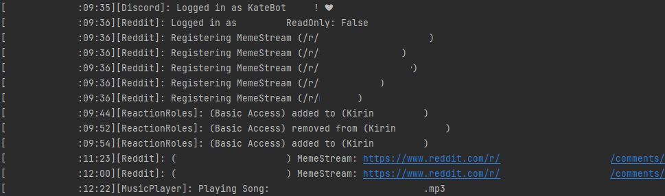

# KateBot

### Recode Feature Complete

Fill out the .json files and copy them into the root of the config folder, then run the bot.

You will need both a Discord Application Token, and a bunch of reddit data, look up "AsyncPraw" quick start for an explanation on the data needed.

Current Features:
- MemeStream (Reddit FeedBot)
- MusicBot 
- ReactionRoles (Dynamically from .json)

Current Commands (Outdated, use !Help):
- !Status -- Is the bot still alive test command.
- !Exit -- Attempts to gracefully shutdown (graceful part being wip)
- !Cleanup \<all|Username> -- Starts deleting messages in the channel it is run in.
- !Join \<Channel_ID> -- Joins a voice channel and creates a voice_client
- !Leave -- Leaves all voice channels
- !Play \<MP3 Filename> -- Plays/queues an mp3 file. (Requires setup in discord.json) 

ToDo: List Depencencies
